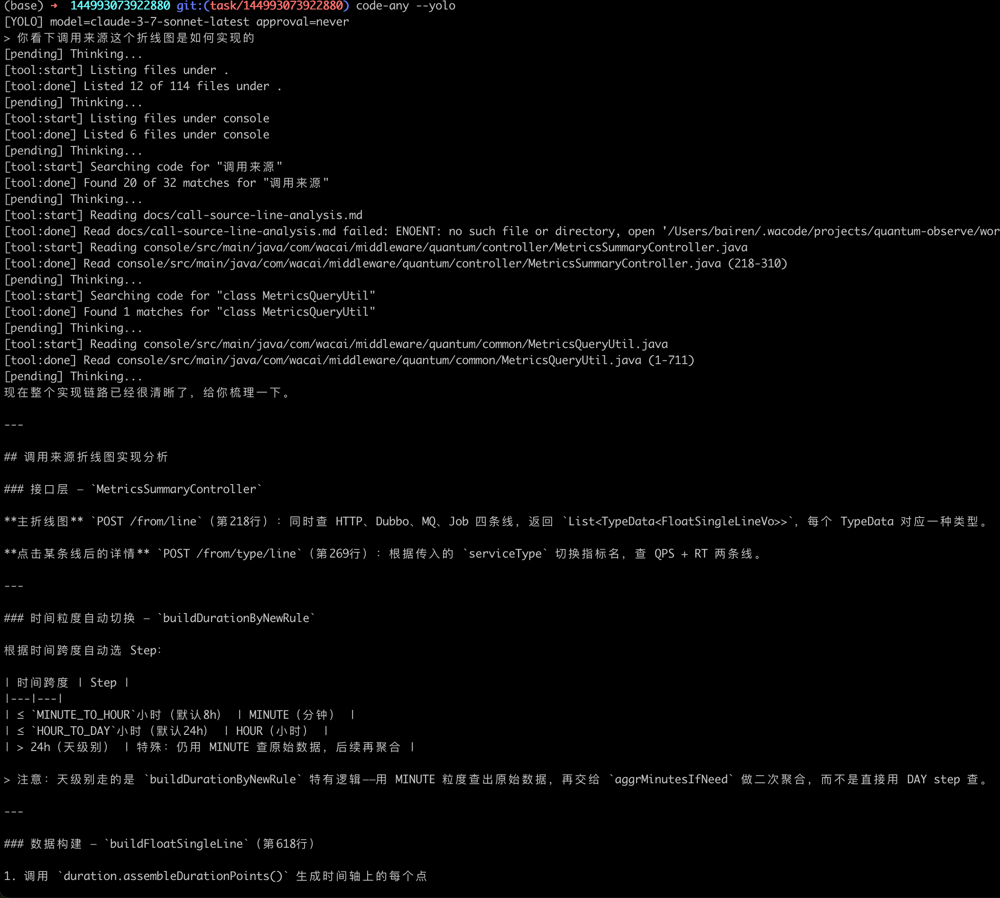

# code-any

[English](README.md)

一个基于 TypeScript 的终端编程代理 — 在本地运行的 Claude Code 风格工作流。

<p align="center">
  
</p>

## 这是什么？

这个项目展示了 Claude Code 风格的代理在底层是如何工作的：

- **Agent 循环** — 与 Anthropic API 进行多轮工具调用的迭代循环
- **上下文工程** — 带预算感知的截断机制，防止大量输出淹没模型
- **Explore 子代理** — 在主代理行动前，用低成本模型先做一轮只读的上下文收集
- **工具输出分离** — 原始输出留在本地，只有结构化摘要发送给模型

如果你好奇过"Claude Code 到底是怎么实现的？"，读源码就对了。

## 快速开始

```bash
# 安装
npm install && npm run build && npm link

# 配置
cp .env.example .env
# 在 .env 中设置 ANTHROPIC_AUTH_TOKEN=your_token_here

# 运行
code-any
```

### CLI 参数

```bash
code-any --model claude-3-7-sonnet-latest  # 选择模型
code-any --cwd /path/to/workspace          # 设置工作目录
code-any --yolo                            # 自动批准所有工具调用
```

### 斜杠命令

| 命令        | 说明                |
|-------------|---------------------|
| `/help`     | 显示内置命令        |
| `/tools`    | 列出可用工具        |
| `/model`    | 显示当前模型        |
| `/approval` | 显示审批模式        |
| `/diff`     | 显示工作区变更      |
| `/clear`    | 清空对话            |
| `/exit`     | 退出                |

## 内置工具

| 工具             | 说明                          |
|------------------|-------------------------------|
| `list_files`     | 列出目录中的文件              |
| `read_file`      | 读取文件内容（支持切片）      |
| `search_code`    | 基于 ripgrep 的代码搜索       |
| `write_file`     | 写入/创建文件（需要审批）     |
| `run_shell`      | 执行 shell 命令（需要审批）   |
| `diff_workspace` | 显示工作区变更                |

## 配置

```bash
ANTHROPIC_AUTH_TOKEN=your_token_here        # 必填
ANTHROPIC_MODEL=claude-3-7-sonnet-latest    # 主模型（默认）
EXPLORE_MODEL=claude-3-5-haiku-latest       # Explore 子代理模型（默认）
DEFAULT_APPROVAL=default                    # 或 "never" 开启 yolo 模式
```

## 开发者

```bash
npm run dev        # 开发模式运行
npm test           # 运行测试
npm run typecheck  # 类型检查
npm run build      # 构建
```

## 许可证

MIT
